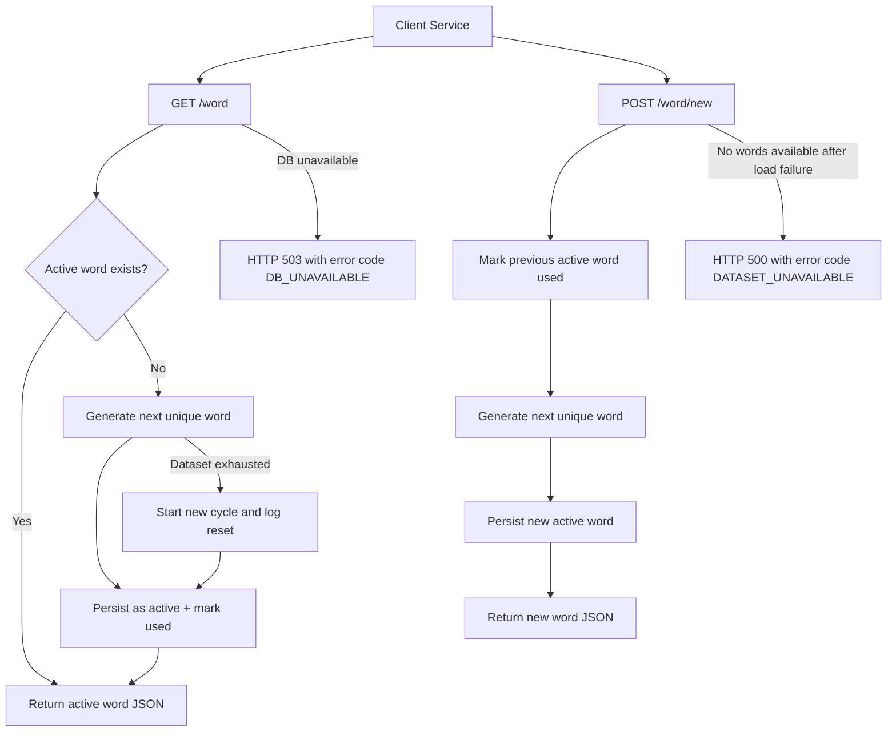

# User Flow - Fetch and Refresh Word

```mermaid
flowchart TD
  C[Client Service] --> G[GET /word]
  G --> Q{Active word exists?}
  Q -->|Yes| R[Return active word JSON]
  Q -->|No| N[Generate next unique word]
  N --> S[Persist as active + mark used]
  S --> R

  C --> P[POST /word/new]
  P --> M[Mark previous active word used]
  M --> U[Generate next unique word]
  U --> V[Persist new active word]
  V --> W[Return new word JSON]

  N -->|Dataset exhausted| X[Start new cycle and log reset]
  X --> S

  G -->|DB unavailable| E1[HTTP 503 with error code DB_UNAVAILABLE]
  P -->|No words available after load failure| E2[HTTP 500 with error code DATASET_UNAVAILABLE]
```
