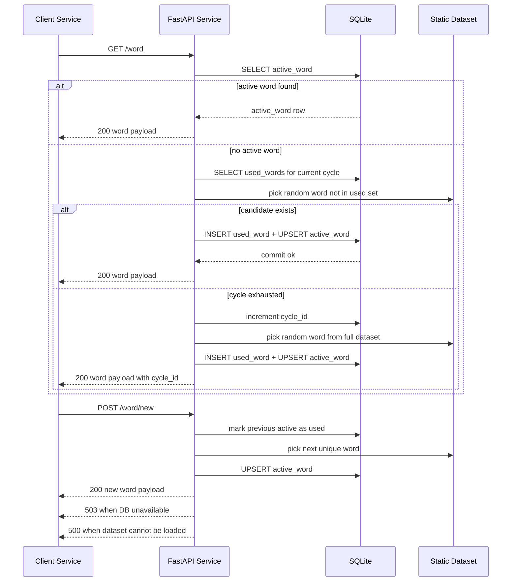

# API Sequence - Generate and Persist Unique Word

```mermaid
sequenceDiagram
  participant Client as Client Service
  participant API as FastAPI Service
  participant DB as SQLite
  participant DS as Static Dataset

  Client->>API: GET /word
  API->>DB: SELECT active_word
  alt active word found
    DB-->>API: active_word row
    API-->>Client: 200 word payload
  else no active word
    API->>DB: SELECT used_words for current cycle
    API->>DS: pick random word not in used set
    alt candidate exists
      API->>DB: INSERT used_word + UPSERT active_word
      DB-->>API: commit ok
      API-->>Client: 200 word payload
    else cycle exhausted
      API->>DB: increment cycle_id
      API->>DS: pick random word from full dataset
      API->>DB: INSERT used_word + UPSERT active_word
      API-->>Client: 200 word payload with cycle_id
    end
  end

  Client->>API: POST /word/new
  API->>DB: mark previous active as used
  API->>DS: pick next unique word
  API->>DB: UPSERT active_word
  API-->>Client: 200 new word payload

  API-->>Client: 503 when DB unavailable
  API-->>Client: 500 when dataset cannot be loaded
```
