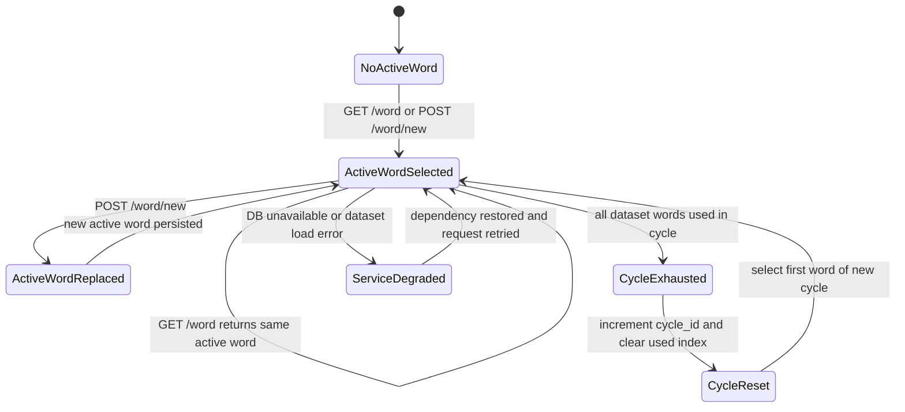

# Domain State - Word Cycle Lifecycle

```mermaid
stateDiagram-v2
  [*] --> NoActiveWord
  NoActiveWord --> ActiveWordSelected: GET /word or POST /word/new

  ActiveWordSelected --> ActiveWordSelected: GET /word returns same active word
  ActiveWordSelected --> ActiveWordReplaced: POST /word/new
  ActiveWordReplaced --> ActiveWordSelected: new active word persisted

  ActiveWordSelected --> CycleExhausted: all dataset words used in cycle
  CycleExhausted --> CycleReset: increment cycle_id and clear used index
  CycleReset --> ActiveWordSelected: select first word of new cycle

  ActiveWordSelected --> ServiceDegraded: DB unavailable or dataset load error
  ServiceDegraded --> ActiveWordSelected: dependency restored and request retried
```
